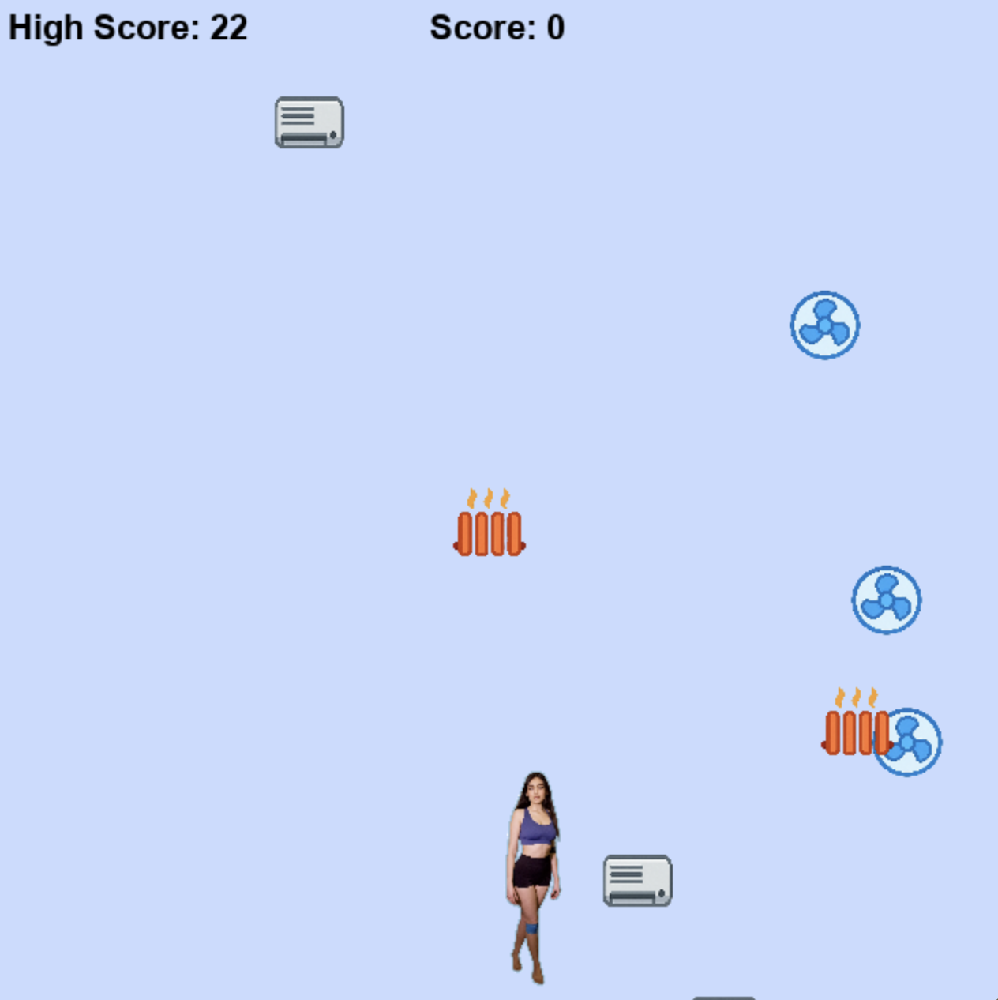

# 🎮 Only-Fanz – by Zara Dar


**Only-Fanz** is a simple 2D arcade-style game built using the **Pygame** library.  
You control Zara, moving left and right to catch only the fans 🌀 while avoiding AC units ❄️ and heaters 🔥.  
Rack up as many points as you can before catching the wrong thing!  

All game assets were created using **ChatGPT image generation**.

> This game is **not affiliated with or endorsed by OnlyFans, OFTV, Fenix International Ltd or Fenix Internet LLC**.  
> It was made purely for fun to demonstrate the creative capabilities of **ChatGPT**.  
> This is a non-commercial, entertainment-only project with **no revenue intent**.

---

## 📸 Screenshot
<div align="center">
  
</div>

---

## ✨ Features

- 🎮 **Play as Zara**, dodging and catching falling objects.
- 🌀 **Catch fans** to gain points.
- ❌ **Avoid ACs and heaters** – one wrong catch ends the game.
- 💪 **Collect power-ups** for special abilities:
    - Cyan: Shield protection
    - Yellow: Slow motion
    - Magenta: Double points
    - Green: Magnet for fans
- 📈 **Increasing difficulty** – objects fall faster as time progresses.
- 🔊 **Sound effects** – satisfying audio cues for good and bad catches.
- 💾 **High score** tracking saved locally.

---

## 🧰 Requirements

- Python 3.x
- [Pygame](https://www.pygame.org/) library

Install Pygame (if not already installed):

```bash
pip install pygame
```

---

## 🗂 Files Included

| File                   | Description                                  |
|------------------------|----------------------------------------------|
| `onlyfanz_game_v1.py`     | Main game script for version 1            |
| `onlyfanz_game_v2.py`     | Main game script for version 2            |
| `zara.png`             | Player sprite with transparent background    |
| `fan.png`              | Good object to catch                         |
| `ac.png`               | Bad object to avoid (AC unit)                |
| `heater.png`           | Bad object to avoid (Heater)                 |
| `collect.wav`          | Sound when a fan is collected                |
| `lose.wav`             | Sound when a wrong item is collected         |
| `only_fanz_highscore.txt` | Automatically created high score file    |

---

## ▶️ How to Play

1. Make sure all the required files are in the same folder.
2. Run the game:

```bash
python onlyfanz_game_v2.py
```

3. Use **←** and **→** arrow keys to move Zara left and right.
4. Catch **fans** to score points.
5. Collect **power-ups** for special abilities:
        Cyan: Shield protection
        Yellow: Slow motion
        Magenta: Double points
        Green: Magnet for fans
6. Avoid **AC units** and **heaters** – if you catch one, it's game over!
7. Your **high score** will be saved automatically.

---

## 💾 High Score

Your best score is saved in a local file called `only_fanz_highscore.txt`.  
Each time you beat your record, the file is updated.

---

## 🎨 Customization Tips

- You can replace the image files (`.png`) or sound files (`.wav`) with your own. Just make sure the file names match those used in the code, or update the paths accordingly.
- Background music can be added using `pygame.mixer.music.load()` if desired.

---

## 📄 License

This project is for **educational and personal use**.  
Feel free to modify or expand on it, and credit the original author if you share it publicly.

---

**Made with ❤️ by Zara Dar**
